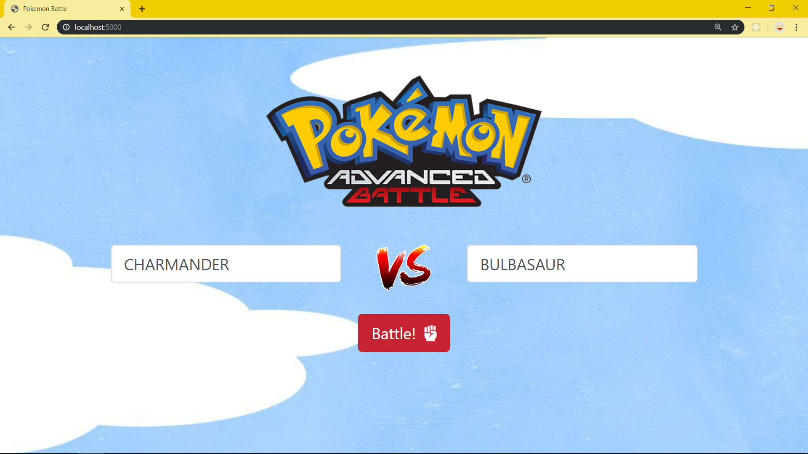

# Machine Learning Exam

#

                  

### **Soal 3 - Pokemon Battle**

Disediakan __beberapa dataset__ seputar data spesies Pokemon beserta history pertandingan antar Pokemon. File **_pokemon.csv_** berisi data lengkap 800 spesies Pokemon, sedangkan file _**combats.csv**_ berisi data historis duel Pokemon beserta pemenangnya. Unduh dataset dari repo ini: [klik sini](./Dataset_3) atau langsung dari sumbernya: [klik sini](https://www.kaggle.com/sekarmg/pokemon).

Dengan dataset tersebut, buatlah sebuah __aplikasi Flask__ berisi model machine learning (model bebas) yang dapat memprediksi pemenang dari duel Pokemon. Aplikasi yang dibuat harus memenuhi syarat minimal berikut:

1. Server aplikasi akan berjalan di __localhost:5000__ dan ketika user melakukan GET request via browser akan tampil sebuah halaman __HTML__ sederhana yang memuat __2 buah text input__ dan __1 buah button__. Desain tampilan HTML tidak harus sama seperti contoh soal, utamakan fitur!

    

2. User dapat memasukkan nama Pokemon yang akan dipertandingkan ke dalam text input yang tersedia. Saat user menekan tombol button __'Battle!'__, aplikasi akan memproses data yang telah diinputkan oleh user.

    

3. Jika data sukses diproses, maka user akan di-_redirect_ ke __localhost:5000/hasil__ berisi halaman __HTML__ yang menampilkan: 
    
    - __Gambar Pokemon__
        - gunakan __Poke API__ ([_klik sini_](https://pokeapi.co/))
        - __GET__ ke https://pokeapi.co/api/v2/pokemon/{nama_Pokemon}

    - __Grafik perbandingan skill Pokemon__ (dari dataset): 
        - HP, 
        - Attack 
        - Defense 
        - Special Attack
        - Special Defense 
        - Speed

    - __Kemungkinan pemenang__ beserta __% probabilitasnya__

    Halaman ini juga dilengkapi __1 buah button__ untuk kembali ke halaman awal. Desain tampilan HTML tidak harus sama seperti contoh soal, utamakan fitur! Contoh:

    -   __Charmander vs Bulbasaur__ 

        

    -   __Pikachu vs Charizard__ 

        

    -   __Mewtwo vs Mew__ 

        
    
4. Namun jika data tidak ditemukan, tidak ada di dalam dataset atau user masuk ke url yang tidak tersedia, maka user akan di-redirect ke halaman __HTML__ yang memberikan informasi bahwa data tidak ditemukan, __error 404__. Halaman ini juga dilengkapi __1 buah button__ untuk kembali ke halaman awal. Desain tampilan HTML tidak harus sama seperti contoh soal, utamakan fitur!

    

_**Catatan:**_

⚠ Poke API memiliki batasan __100 API request per IP address per menit__. Jika Anda mengalami kendala dikarenakan telah mencapai limit, maka tunggulah sejenak beberapa menit, lalu coba call API kembali.

✅ _Commit & push source code jawaban soal ini ke __Github__ Anda, buatlah repo dengan nama __Pokemon_Battle__, kemudian lampirkan __url link repo Github__ Anda via email ke lintang@purwadhika.com!_

                  

#

### *__#HappyCoding__* :relaxed:

#### Lintang Wisesa :love_letter: _lintangwisesa@ymail.com_

[Facebook](https://www.facebook.com/lintangbagus) | 
[Twitter](https://twitter.com/Lintang_Wisesa) |
[Google+](https://plus.google.com/u/0/+LintangWisesa1) |
[Youtube](https://www.youtube.com/user/lintangbagus) | 
:octocat: [GitHub](https://github.com/LintangWisesa) |
[Hackster](https://www.hackster.io/lintangwisesa)